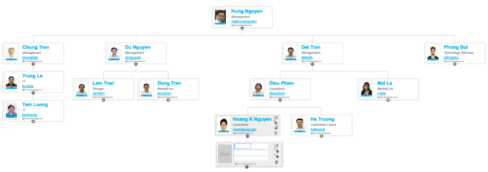
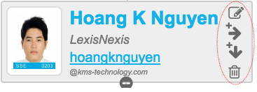
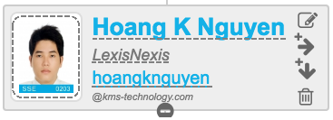
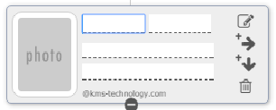
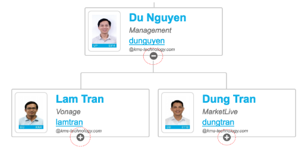

# Requirements
OrgChart Editor is a web page that helps render an organization chart based on given contact model. A user can edit each contact information in the chart, add a new contact or even delete a contact and its related contacts.

**Note:** You are requested to learn and practice 'pure' ECMAScript 6 and beyond, it is _not allowed_ to use any 3rd-party library except the libraries are already available in Assignment initial code. To build the Org Chart, you can use Canvas but it's recommended to use HTML and CSS by following the base code (referenced from http://fiddle.jshell.net/hp5ksgfh/6/?utm_source=website&utm_medium=embed&utm_campaign=hp5ksgfh).

### Root Card
A root card is a card that has no superior card and can't be removed or inserted a peer card

### Card
Each card shows avatar, name, Project (or Department if project is empty) and Account ID

### Card Actions
When clicking on a card, it shows a set of action buttons at right side of the card

#### 1. Edit Card content
a. Inline edit the Contact info: Name, Department (dropdown list), Account ID.

b. Upload new Contact photo by click on the image area

c. When clicking outside the selected card, contact data will be stored in Local Storage

#### 2. Insert new Peer-card
a. The new empty card would be displayed beside the selected card

b. It is allowed to update Contact info and photo as same as 'Edit Card content'

c. This action is not available for root card

#### 3. Insert new Subordinate-card
a. The new empty card would be displayed below the selected card

b. It is allowed to update Contact info and photo as same as 'Edit Card content'

#### 4. Delete Card
a. Show the confirmation message "Please confirm to delete." and delete the selected card. When a card is deleted, all its subordinate-cards no longer exist.

b. This action is not available for root card

### Collapse/Expand Subordinate-cards
Toggle the +/- icon at the middle-bottom card to make all subordinate cards to be hidden or visible

### Unit Test
- Coverage more than 50%
- Follow [Arrange, Act, and Assert](http://wiki.c2.com/?ArrangeActAssert)

### Change Superior-card (Bonus points)
- User can change superior card of a card by selecting a card then drag and drop it into a card that he wants to be the superior card.
- User can not select a subordinate card of selected card to make it as superior card

### Change Root Card (Bonus points)
User can make a card to be root card by double-clicking on it.
Org chart would be re-render to only display all cards belong to the root card.

# Source Code
Pre-requisites: Node.js 4.x or later

**Install Project Dependences:** ` npm install`

**Run:**

-  **build:** `npm run build`
-  **run server**: `npm run serve`
-  **test**: `npm run test`
-  **test-watch**: `npm run test-watch`